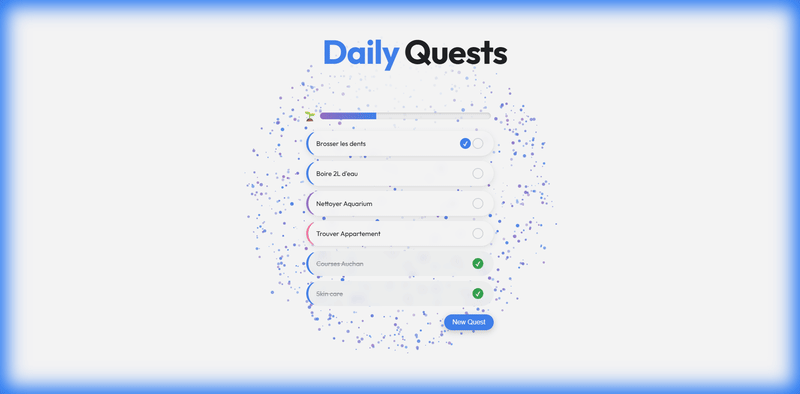

# Daily Quest - Gamified Task Manager

**Daily Quest** is a personal task management application designed to gamify your daily life. It focuses on visual feedback, streak building, and aesthetic simplicity to help you build habits and track your consistent progress.




## 🚀 Features

*   **Daily Quests**: Create and track daily tasks.
*   **Recurring Habits**: special support for Weekly, Monthly, and flexible Recurring quests (e.g., Mon/Wed/Fri).
*   **Streak System**: Visual "Heat" streaks for perfect days and specific habit tracking.
*   **Visual Feedback**:
    *   **Particle Effects**: Satisfying confetti upon quest completion.
    *   **Progress Bars**: Dynamic emojis (🌱 -> 🏆) based on daily completion %,
    *   **Dashboard**: Weekly wave charts, global stats, and "Best Streak" tracking.
*   **Encrypted Auth**: Simple, client-side encryption for personal use (single-user focus).
*   **Mobile Responsive**: Optimized for both desktop and mobile views.

## 🛠️ Technology Stack

*   **Frontend**: Vanilla HTML5, CSS3, JavaScript (ES6+). No heavy frameworks.
*   **Backend / Database**: Google Firebase (Firestore).
*   **Encryption**: `crypto-js` for securing configuration keys.
*   **Hosting**: GitHub Pages (Static hosting).

## 📂 Project Structure

```
/
├── assets/             # Images and global assets
│   └── demo.gif        # Demo recording
├── css/
│   └── style.css       # Global styles
├── docs/               # Documentation & Handover
├── js/                 # Logic modules
│   ├── script.js       # Main controller
│   ├── daily.js        # Daily logic
│   └── ...             # Other modules
├── index.html          # Main entry point
└── README.md           # This file
```

## 🔧 Setup & Installation

Since this is a client-side application using Firebase:

1.  **Clone the repository**:
    ```bash
    git clone https://github.com/MattVil/dailyquest.git
    cd dailyquest
    ```
2.  **Firebase Configuration**:
    *   The project expects an encrypted configuration string in `auth.js`.
    *   For your own specific instance, you can replace `ENCRYPTED_CONFIG` with your own Firebase config or modify `auth.js` to load from a local environment file.
3.  **Run Locally**:
    *   Serve the files using any static server (e.g., Live Server in VS Code, `python -m http.server`, etc.).
    *   Open `http://localhost:8000`.

## 🤝 Future Plans

*   **Hall of Fame**: A dedicated section for your longest-running habits.
*   **Advanced Options**: Subtasks, Timers, and specific "Anti-Habits".
*   **Native Mobile App**: Potential wrapper for iOS/Android.

---
*Created by [MattVil](https://github.com/MattVil)*
