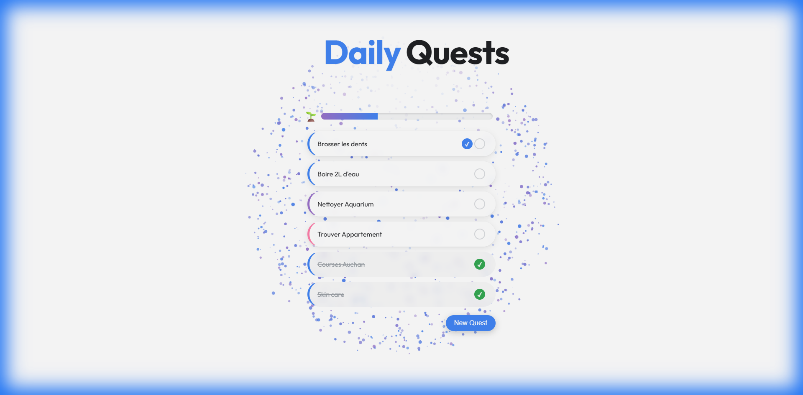
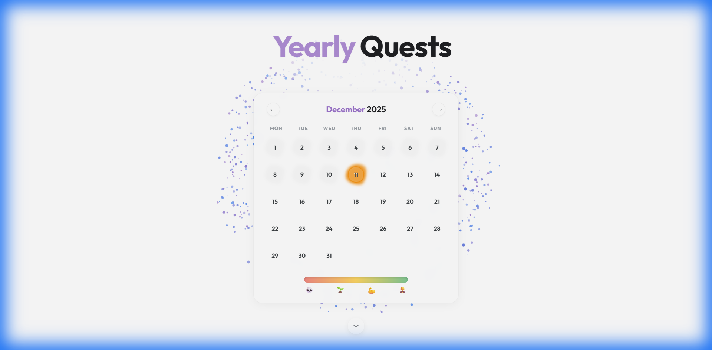
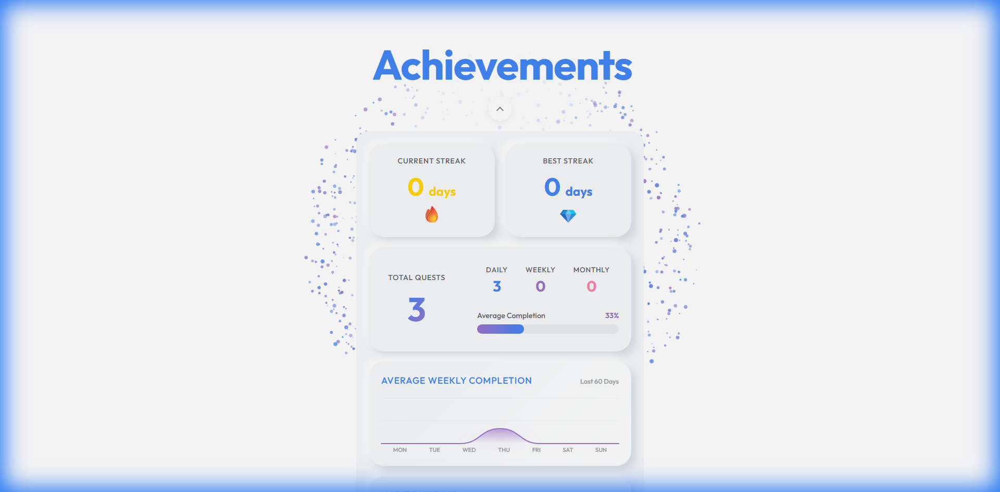
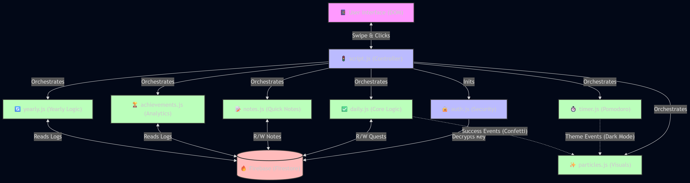
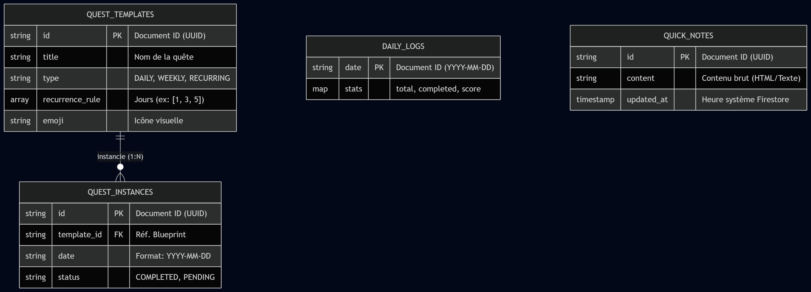

# 📘 Daily Quest - Project Handover Documentation

**Version:** 1.0.0 (Beta Release)
**Date:** December 11, 2025
**Author:** Engineering Team (Antigravity)

---

## 1. 🎯 Project Goals & Scope

### 1.1. Objective
The primary goal of **Daily Quest** is to transform personal task management into an engaging, gamified experience. Unlike standard to-do lists, this application emphasizes:
*   **Visual Gratification**: Immediate visual rewards (particles, dynamic emojis) for completing tasks.
*   **Consistency Tracking**: Highlighting streaks to encourage daily engagement.
*   **Aesthetic "Chill"**: A clean, distraction-free UI that feels like a modern app, not a spreadsheet.

### 1.2. Key Constraints
*   **Platform**: Web-based (PWA-ready), focusing on Desktop and Mobile responsiveness.
*   **Hosting**: Clients-side execution on **GitHub Pages** (Static Site).
*   **Backend**: Serverless architecture using **Firebase Firestore** for real-time data sync.
*   **Security**: Lightweight password protection using `AES` encryption for configuration keys.

---

## 2. 📱 Functionalities & UI

### 2.1. The Daily Dashboard
The core interface where users manage their day-to-day operations.



*   **Quest List**: Dynamic rendering of `DAILY`, `WEEKLY`, and `RECURRING` quests.
*   **Progress Bar**: A top bar that fills up as "Score" increases. Uses a 0-100 scale where each quest contributes equally.
*   **Feedback Loop**: Completing a quest triggers the `ParticleSystem` (confetti) and updates emojis (e.g., "🌱" -> "🔥").

### 2.2. Yearly Overview (Heatmap)
A "GitHub-style" visualization of productivity over time.



*   **Logic**: Iterates through `daily_logs` collection.
*   **Color Scale**:
    *   🔴 < 50% Coverage
    *   🟡 ~ 50-80% Coverage
    *   🟢 > 80% Coverage
*   **Orbs**: Each day is represented by an animated "Orb" (`.day-orb`). The animation timing is randomized in `yearly.js` to create an organic "breathing" effect.

### 2.3. Achievements Panel
A dedicated statistics view for long-term progression.



*   **Weekly Wave Chart**: A smooth SVG bezier curve showing the last 7 days' performance.
*   **Habit Streaks**: Tracks recurring tasks (e.g., "Gym"). A habit is considered "Formed" (🏆) after 30 days.
*   **Global Stats**: Total count of all quests ever completed.

---

## 3. 🏗️ System Design & Architecture

The system follows a bespoke **Model-View-Controller (MVC)** pattern implemented in Vanilla JS to avoid heavy framework overhead.

### 3.1. Architecture Diagram



**Key Components:**
1.  **`script.js` (Controller)**: The entry point. Handles the "Router" (Navigation logic) and orchestrates initialization.
2.  **`auth.js` (Security Layer)**: Decrypts the Firebase Config using a user-provided password.
3.  **`daily.js` (Business Logic)**: Manages Quest state, Optimistic UI updates, and writes to `quest_instances`.
4.  **`achievements.js` (Analytics)**: Complex aggregation queries for streaks and charts.
5.  **`particles.js` (Visual Engine)**: A standalone 3D particle system running on an HTML5 Canvas overlay.

### 3.2. Data Flow
1.  **Hydration**: On load, `DailyLogic` fetches today's quests, while `YearlyLogic` fetches a lightweight snapshot of the month's scores.
2.  **Interaction**:
    *   User clicks "Check".
    *   UI updates immediately (CSS class `.completed`).
    *   `DailyLogic` writes to Firestore `quest_instances` (add/remove).
    *   `DailyLogic` recalculates the day's Score and updates `daily_logs` document.
    *   `AchievementsLogic` stats buffer is invalidated.

---

## 4. 🗄️ Database Design (Firestore)

The database is NoSQL (Document-oriented), optimized for read-heavy operations on the dashboard.

### 4.1. Entity Relationship Diagram (ERD)



### 4.2. Collection Schema Details

#### `quest_templates`
The "Blueprint" for a task.
```json
{
  "id": "uuid",
  "title": "Drink Water",
  "type": "DAILY | WEEKLY | RECURRING",
  "recurrence_rule": [1, 3, 5], // Mon, Wed, Fri
  "emoji": "💧"
}
```

#### `quest_instances`
The concrete realization. Created *only* when needed (lazy instantiation or user action).
```json
{
  "id": "uuid",
  "template_id": "ref(quest_templates)",
  "date": "2025-12-11",
  "status": "COMPLETED | PENDING"
}
```

#### `daily_logs` (Aggregated)
Used for the Heatmap to avoid fetching thousands of instances.
```json
{
  "date": "2025-12-11", // Document ID
  "stats": {
    "total": 5,
    "completed": 4,
    "score": 80
  }
}
```

---

## 5. 🛠️ Implementation Details & Edge Cases

### Streak Calculation Algorithm
Calculated in `achievements.js`.
1.  Fetches the last 365 entries from `daily_logs` ordered by date descending.
2.  Iterates backward from Today.
3.  Increment streak if `score === 100`.
4.  **Edge Case**: If Today is not yet 100%, it does *not* break the streak (streak is "pending"). It only breaks if Yesterday was < 100%.

### Encryption (Auth)
*   **Library**: `crypto-js`.
*   **Mechanism**: The Firebase Configuration Object (API Keys) is stored as an AES-encrypted string in `auth.js`.
*   **Flow**: User enters password -> App attempts decryption -> If JSON parse fails, password is wrong.

---

## 6. 🔮 Future Works

To further enhance the product, the following features are proposed for the V2 roadmap:

1.  **Hall of Fame 🏛️**
    *   A dedicated view for "Retired" or "Mastered" habits (30+ days).
2.  **Advanced Options ⚙️**
    *   **Timers**: Pomodoro integration directly in the quest card.
    *   **Subtasks**: Checklist within a quest.
3.  **Social Mode 👯**
    *   "Accountability Partner": Share a read-only view of your streak with a friend.

---

*Prepared for Client Review - December 2025*
